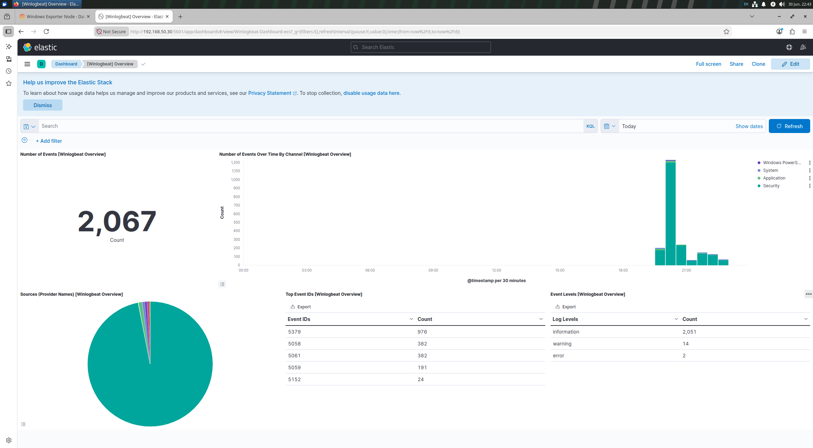
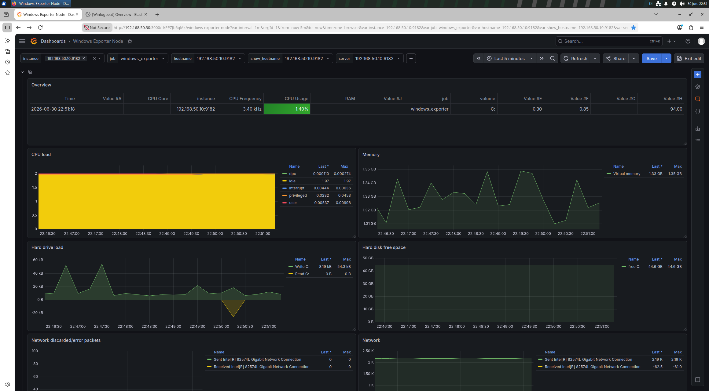

# 🛡️ Mini-SOC : Supervision et Détection d'Intrusions

## 📝 Description du Projet
Ce projet, réalisé par notre équipe de six étudiants, présente la conception, le déploiement et la validation technique d'un **Centre d'Opérations de Sécurité (SOC)** à échelle réduite. 

L'objectif principal est d'unifier la supervision logique (analyse de sécurité) et la supervision matérielle (métrologie) au sein d'une infrastructure moderne et centralisée.

---

## 🏗️ Architecture Technique
L'ensemble de l'infrastructure du SOC est déployé via **Docker Compose** sur un serveur Ubuntu, garantissant une portabilité totale (Infrastructure as Code).

* **Hyperviseur :** VMware Workstation
* **Analyse Logique & SIEM :** Elasticsearch & Kibana (Collecte via l'agent Winlogbeat).
* **Métrologie & Supervision Matérielle :** Prometheus & Grafana (Collecte via l'agent Windows Exporter).
* **Environnement Cible :** Windows 10 Professionnel.
* **Environnement Offensif :** Kali Linux.

---

## 📊 Interfaces de la Maquette

### 1. Serveur Central (Ubuntu SOC)
Hébergement des conteneurs Docker pour Elasticsearch, Kibana, Prometheus et Grafana.

### 2. Supervision de la Sécurité (Elasticsearch / Kibana)
Analyse centralisée des journaux d'événements pour la détection des comportements suspects.

### 3. Métrologie Système (Grafana)
Suivi en temps réel de la charge matérielle des machines surveillées.

### 4. Environnement Offensif (Kali Linux)
Machine utilisée par la Red Team pour simuler les attaques.

### 5. Machine Cible (Windows 10)
Génération de la télémétrie et des journaux d'événements suite aux attaques.

---

## 🚀 Reproductibilité
Les fichiers de configuration YAML et INI utilisés pour ce laboratoire sont disponibles dans les dossiers de ce dépôt pour permettre la reproduction de l'environnement.
